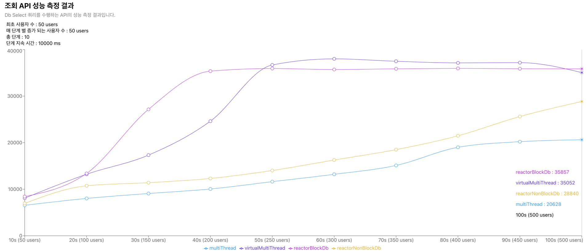
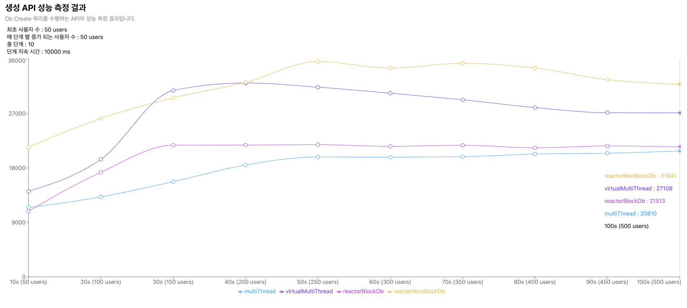
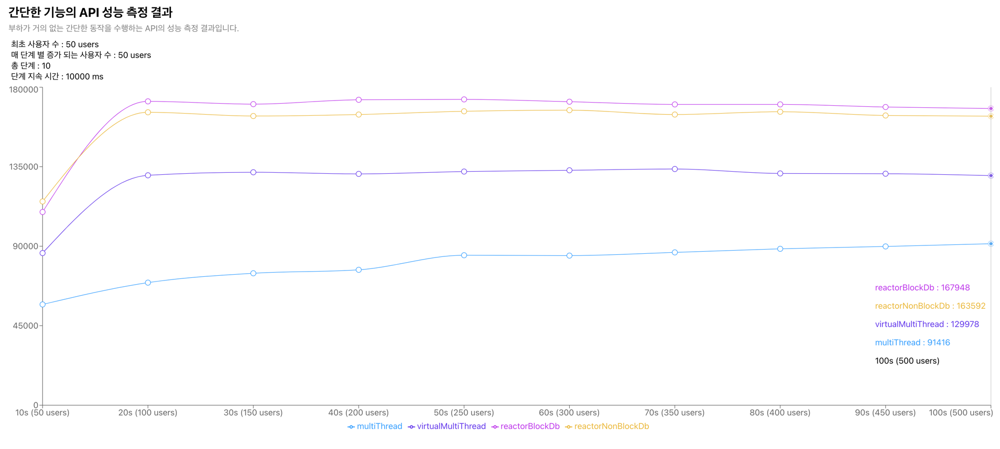
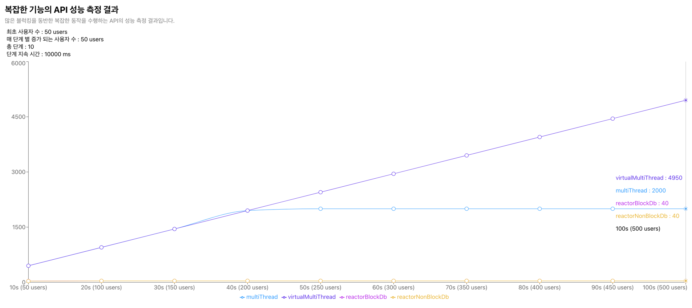
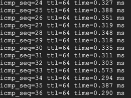
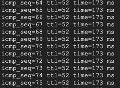

# Spring MVC Rest VS WEB Flux Rest
해당 저장소는 멀티스레드 방식으로 구현된 Rest API와 비동기 논블록킹 방식으로 구현된 Rest API의 성능을 비교하는 것을 목표로 합니다.

# 측정 비교 대상
성능을 비교할 대상들 입니다. 각 대상들의 설정(스레드 개수, 워커 개수, DB 커넥션 수 등)들은 기본값을 사용하였습니다.
- 멀티 스레드 방식의 REST API
> multi-thread-api-app <br/>http://localhost:8081
- 가상 스레드를 사용한 멀티 스레드 방식의 REST API
> virtual-multi-thread-api-app <br/>http://localhost:8082
- 논블록킹 방식으로 구현된 Rest API (블록킹 DB)
> reactor-api-block-db-app <br/>http://localhost:8083
- 논블록킹 방식으로 구현된 Rest API (논 블록킹 DB)
> reactor-api-non-block-db-app <br/>http://localhost:8084

# 측정 시나리오
요청을 반복하는 가상의 사용자들을 만들고 일정 시간마다 단계가 상승하면 가상의 사용자들을 추가하면서 성능을 측정합니다.
> 초기 100명의 가상의 사용자가 존재하고 5초마다 100명씩 증가하여 총 50초간 측정을 진행하고 5초마다 수치를 기록합니다.
> 
> 성능 측정은 `measurement-app` 앱을 통해 측정을 진행합니다.

# 측정 항목
각 측정 비교 대상들의 아래 형태의 API를 측정합니다.
- DB 조회 API
- DB 쓰기 API
- 가벼운 기능의 API
- 무거운 기능의 API
- 블로킹이 포함된 API
> **측정 정보 :** 최소 요청 시간, 최대 요청 시간, 평균 요청 시간, 성공 요청 횟수, 실패 요청 횟수


# 측정 환경
측정 앱과 대상 앱 사이의 영향도를 최소화 하기 위해 Google Cloud Platform의 VM 인스턴스 총 3대를 사용합니다.
> 측정 모듈 1대, 대상 서버 1대, DB 1대

## 측정 VM
성능 측정 모듈이 동작할 VM
- OS: RockyOS 9
- CPU: 2 vCPU(1 Core) Intel(R) Xeon(R) CPU @ 2.20GHz
- Memory: 2GB

## 대상 VM
측정 대상 서비스가 동작할 VM
- OS: RockyOS 9
- CPU: 2 vCPU(1 Core) Intel(R) Xeon(R) CPU @ 2.20GHz
- Memory: 2GB

## DB VM
대상 서비스가 사용할 DB 서비스 VM
- OS: RockyOS 9
- CPU: 2 vCPU(1 Core) Intel(R) Xeon(R) CPU @ 2.20GHz
- Memory: 2GB
- Version : MariaDB 10.5.22

## 관련 프레임워크 및 라이브러리
- Spring boot 3
- Spring Shell
- Web MVC
- Web Flux

## JDK VERSION
-  21

# 측정 방법
측정을 수행하였던 방법을 기술하며 기술된 모든 커맨드는 project의 최상위 디렉터리에서 진행됩니다.
## Build
측정 대상들과 측정을 진행하는 앱을 빌드합니다.
```shell
sh gradlew clean app:multi-thread-api-app:build app:virtual-multi-thread-api-app:build  app:reactor-api-block-db-app:build  app:reactor-api-non-block-db-app:build app:measurement-app:build -x test 
```

## 멀티 스레드 방식 API 측정
멀티 스레드 방식의 읽기/쓰기 API에 대한 성능 측정 방식입니다.
### 구동
```shell
java -jar app/multi-thread-api-app/build/libs/multi-thread-api-app-1.0.jar
```
### 읽기 API 측정
```shell
java -jar app/measurement-app/build/libs/measurement-app-1.0.jar read -u http://{target_address}:8081 -t 50 -i 50 -d 10000 -p 10 -o multi-thread-read-api-output.json
```
### 쓰기 API 측정
```shell
java -jar app/measurement-app/build/libs/measurement-app-1.0.jar create -u http://{target_address}:8081 -t 50 -i 50 -d 10000 -p 10 -o multi-thread-create-api-output.json
```
### 가벼운 API 측정
```shell
java -jar app/measurement-app/build/libs/measurement-app-1.0.jar simple -u http://{target_address}:8081 -t 50 -i 50 -d 10000 -p 10 -o multi-thread-simple-api-output.json
```
### 무거운 API 측정
```shell
java -jar app/measurement-app/build/libs/measurement-app-1.0.jar heavy -u http://{target_address}:8081 -t 50 -i 50 -d 10000 -p 10 -o multi-thread-heavy-api-output.json
```
### 블로킹이 포함된 API 측정
```shell
java -jar app/measurement-app/build/libs/measurement-app-1.0.jar block -u http://{target_address}:8081 -t 50 -i 50 -d 10000 -p 10 -o multi-thread-block-api-output.json
```

## 가상 스레드 방식 API 측정
가상 스레드 방식의 읽기/쓰기 API에 대한 성능 측정 방식입니다.
### 구동
```shell
java -jar app/virtual-multi-thread-api-app/build/libs/virtual-multi-thread-api-app-1.0.jar
```
### 읽기 API 측정
```shell
java -jar app/measurement-app/build/libs/measurement-app-1.0.jar read -u http://{target_address}:8082 -t 50 -i 50 -d 10000 -p 10 -o virtual-multi-thread-read-api-output.json
```
### 쓰기 API 측정
```shell
java -jar app/measurement-app/build/libs/measurement-app-1.0.jar create -u http://{target_address}:8082 -t 50 -i 50 -d 10000 -p 10 -o virtual-multi-thread-create-api-output.json
```
### 가벼운 API 측정
```shell
java -jar app/measurement-app/build/libs/measurement-app-1.0.jar simple -u http://{target_address}:8082 -t 50 -i 50 -d 10000 -p 10 -o virtual-multi-thread-simple-api-output.json
```
### 무거운 API 측정
```shell
java -jar app/measurement-app/build/libs/measurement-app-1.0.jar heavy -u http://{target_address}:8082 -t 50 -i 50 -d 10000 -p 10 -o virtual-multi-thread-heavy-api-output.json
```
### 블로킹이 포함된 API 측정
```shell
java -jar app/measurement-app/build/libs/measurement-app-1.0.jar block -u http://{target_address}:8082 -t 50 -i 50 -d 10000 -p 10 -o virtual-multi-thread-block-api-output.json
```

## 논블록킹 방식(with blocking DB) API 측정
논블록킹 방식(blocking DB) 읽기/쓰기 API에 대한 성능 측정 방식입니다.
### 구동
```shell
java -jar app/reactor-api-block-db-app/build/libs/reactor-api-block-db-app-1.0.jar
```
### 읽기 API 측정
```shell
java -jar app/measurement-app/build/libs/measurement-app-1.0.jar read -u http://{target_address}:8083 -t 50 -i 50 -d 10000 -p 10 -o reactor-read-api-block-db-output.json
```
### 쓰기 API 측정
```shell
java -jar app/measurement-app/build/libs/measurement-app-1.0.jar create -u http://{target_address}:8083 -t 50 -i 50 -d 10000 -p 10 -o reactor-create-api-block-db-output.json
```
### 가벼운 API 측정
```shell
java -jar app/measurement-app/build/libs/measurement-app-1.0.jar simple -u http://{target_address}:8083 -t 50 -i 50 -d 10000 -p 10 -o reactor-simple-api-block-db-output.json
```
### 무거운 API 측정
```shell
java -jar app/measurement-app/build/libs/measurement-app-1.0.jar heavy -u http://{target_address}:8083 -t 50 -i 50 -d 10000 -p 10 -o reactor-heavy-api-block-db-output.json
```
### 블로킹이 포함된 API 측정
```shell
java -jar app/measurement-app/build/libs/measurement-app-1.0.jar block -u http://{target_address}:8083 -t 50 -i 50 -d 10000 -p 10 -o reactor-block-api-block-db-output.json
```

## 논블록킹 방식(with non blocking DB) API 측정
논블록킹 방식(non blocking DB) 읽기/쓰기 API에 대한 성능 측정 방식입니다.
### 구동
```shell
java -jar app/reactor-api-non-block-db-app/build/libs/reactor-api-non-block-db-app-1.0.jar
```
### 읽기 API 측정
```shell
java -jar app/measurement-app/build/libs/measurement-app-1.0.jar read -u http://{target_address}:8084 -t 50 -i 50 -d 10000 -p 10 -o reactor-read-api-non-block-db-output.json
```
### 쓰기 API 측정
```shell
java -jar app/measurement-app/build/libs/measurement-app-1.0.jar create -u http://{target_address}:8084 -t 50 -i 50 -d 10000 -p 10 -o reactor-create-api-non-block-db-output.json
```
### 가벼운 API 측정
```shell
java -jar app/measurement-app/build/libs/measurement-app-1.0.jar simple -u http://{target_address}:8084 -t 50 -i 50 -d 10000 -p 10 -o reactor-simple-api-non-block-db-output.json
```
### 무거운 API 측정
```shell
java -jar app/measurement-app/build/libs/measurement-app-1.0.jar heavy -u http://{target_address}:8084 -t 50 -i 50 -d 10000 -p 10 -o reactor-heavy-api-non-block-db-output.json
```
### 블로킹이 포함된 API 측정
```shell
java -jar app/measurement-app/build/libs/measurement-app-1.0.jar block -u http://{target_address}:8084 -t 50 -i 50 -d 10000 -p 10 -o reactor-block-api-non-block-db-output.json
```

# 측정 결과
`측정 항목`(DB 조회 API, DB 쓰기 API, 가벼운 기능의 API, 무거운 기능의 API)별로 `측정 비교 대상`들의 측정 수치를 나타냅니다.
<br/>`X축은 동작 시간`을 나타내고 `Y축은 요청 성공 횟수`를 나타냅니다
<br/>※ 해당 측정에서 요청 실패는 없었습니다.

## DB 조회 API
DB 조회가 포함된 API의 성능 측정 결과 입니다.

-----------
- 최초 사용자 수 : 50 users
- 매 단계 별 증가 되는 사용자 수 : 50 users
- 총 단계 : 10
- 단계 지속 시간 : 10s
-----------

> `가상스레드 방식`과 `논블록킹 방식(DB는 블록킹)`이 높은 성능을 나타내었습니다.

## DB 쓰기 API
DB 쓰기가 포함된 API의 성능 측정 결과 입니다.

-----------
- 최초 사용자 수 : 50 users
- 매 단계 별 증가 되는 사용자 수 : 50 users
- 총 단계 : 10
- 단계 지속 시간 : 10s
-----------

> `가상스레드 방식`과 `논블록킹 방식(논 블록킹 DB)`이 높은 성능을 나타내었습니다.

## 가벼운 기능의 API
부하가 거의 없는 간단한 동작을 수행하는 API의 성능 측정 결과 입니다. 
<br/>※ 해당 측정에서 논블록킹 방식의 API는 `블록킹 DB, 논 블록킹 DB 구분 없이 같은 로직을 사용`합니다.

-----------
- 최초 사용자 수 : 50 users
- 매 단계 별 증가 되는 사용자 수 : 50 users
- 총 단계 : 10
- 단계 지속 시간 : 10s
-----------

> `논블록킹 방식의 API`가 가장 높은 성능을 나타내었으며 그 다음으로 `가상스레드 방식`이 높은 성능을 나타내었습니다.

## 무거운 기능의 API
많은 CPU 처리량을 요구하는 API의 성능 측정 결과입니다. (CPU 바운드)
<br/>※ 해당 측정에서 소인수 분해 로직을 통해 많은 CPU 처리를 요구하도록 하였습니다.

-----------
- 최초 사용자 수 : 50 users
- 매 단계 별 증가 되는 사용자 수 : 50 users
- 총 단계 : 10
- 단계 지속 시간 : 10s
-----------

> 모든 대상이 비슷한 성능을 보여주었지만 후반부로 갈 수록 논블로킹과 가상스레드 방식에 약간의 성능저하가 발생하였고, 멀티스레드 방식이 가장 좋은 성능을 보여주었습니다.
> ```
> 해당 API에서는 멀티스레드 방식의 경우 부하를 유발하는 실질적인 로직(소수 개수 구하기)에서 I/O 바운드 작업이 없었습니다.
> 따라서 논블로킹 방식에서는 이벤트 루프와 콜백 구조가 오히려 오버헤드를 일으켰고, 가상스레드 방식 역시 Platform thread와 virtual thread의 관리 및 스케줄링 비용이 발생하여 오버헤드를 일으켰습니다.
> 이로 인해 멀티스레드 방식이 가장 좋은 성능을 보여주게 되었습니다.
> ※ 실제로 동일한 로직 수행간 많은 context switch를 유발시킬 경우 멀티스레드 방식의 성능이 가장 낮게 나타납니다.
> ```


## 블로킹이 포함된 API
스레드 작업에 많은 블로킹이 동반되는 API의 성능 측정 결과 입니다. 
<br/>※ API는 1초동안 스레드를 sleep하는 로직을 공통적으로 수행합니다.
<br/>※ 설정은 모두 기본값을 사용하였습니다. (web flux의 경우 최소 수치인 4개의 스레드 워커가 할당되었습니다.)

-----------
- 최초 사용자 수 : 50 users
- 매 단계 별 증가 되는 사용자 수 : 50 users
- 총 단계 : 10
- 단계 지속 시간 : 10s
-----------

> 가상스레드 방식이 가장 많은 처리량을 나타내었으며, 각 `측정 비교 대상`들의 최대 허용치에 따라 순위가 결정된 것으로 나타났습니다.

# 번외
## `r2dbc`와 `jdbc`중 어느게 더 빠른가?
r2dbc는 DB 요청을 비동기로 처리해주기 때문에 스레드가 blocking되는 현상을 방지하여 요청을 효율적으로 처리할 수 있습니다.
<br/>그러나 특정한 상황에서는 r2dbc보다 jdbc가 더 빠른 결과를 보여주기도 합니다.
<br/>이러한 현상은 비동기 프로그래밍을 위한 작업(이벤트 루프, 커넥션 관리 등)이 오히려 오버헤드를 일으켰고 그 결과 JDBC가 더 좋은 성능을 보여주게 되는 것으로 보입니다.
<br/>`따라서 블럭킹을 비동기로 전환할 기회가 많을 수록 r2dbc가 성능상 유리하고 그렇지 않을 경우 jdbc가 더 유리합니다.`
### 실험
블로킹 시간에 따른 r2dbc와 jdbc의 성능을 비교해 보기 위해서 `DB의 위치를 물리적으로 가까운 거리와 먼 거리에 두고 테스트를 진행`해 보았습니다.
> ### 가까운 거리의 DB ping 속도
> API 대상 서버 => DB 서버의 ping 응답 속도는 약 0.3ms 입니다.
>
> 
> ### 먼 거리의 DB ping 속도
> API 대상 서버 => DB 서버의 ping 응답 속도는 약 170ms 입니다.
>
> 

### 조회 API 비교
`r2dbc`와 `jdbc`의 `조회 API 성능`을 `가까운 거리와 먼 거리의 DB환경`에서 측정한 뒤 비교하였습니다.

> DB의 거리가 가까운 경우 `jdbc`의 처리량이 우세하였으나 `DB 거리가 먼 경우 연결 요청을 비동기로 처리한 r2dbc가 훨씬 많은 처리량`을 나타내었습니다.

### 생성 API 비교
`r2dbc`와 `jdbc`의 `생성 API 성능`을 `가까운 거리와 먼 거리의 DB환경`에서 측정한 뒤 비교하였습니다.

> DB의 거리가 가까운 경우 비슷한 양상을 보여주었으나 `DB 거리가 먼 경우 연결 요청을 비동기로 처리한 r2dbc가 훨씬 많은 처리량`을 나타내었습니다.

### 결론
DB에 요청한 query의 수행속도, 네트워크 지연속도 등에 따라 `블로킹이 많이 발생할 수록 r2dbc가 더 나은 처리량을 제공`하고, 
단순한 query와 빠른 네트워크 연결로 인해 `블로킹이 거의 발생하지 않을 경우에는 jdbc가 유리한 환경`이 될 수 있습니다.

## CPU 바운드에서 많은 컨텍스트 스위칭을 유발한다면?
`무거운 기능의 API` 성능 측정 결과처럼 CPU 바운드에서는 기존의 멀티스레드 방식이 미미하지만 조금 더 좋은 성능을 보여주었습니다.
만약 해당 API가 더 많은 컨텍스트 스위칭을 발생시키도록 스케줄러에게 요청한다면 결과에 어떤 변화가 있을 지 측정을 해보았습니다.
### 실험
기존 `무거운 기능의 API`는 소수의 개수를 찾는 방식으로 CPU 바운드를 구현하였습니다. 해당 로직에 소수를 찾을 때 마다 `Thread.yield()` 메서드를 호출하여 컨텍스트 스위칭을 유도한 뒤 성능을 테스트 하였습니다.
> `Thread.yield()`메서드는 현재 실행 중인 스레드가 CPU를 다른 스레드에게 양보하도록 흰트룰 주지만 
> JVM 구현과 운영 체제의 스케줄러 정책에 따라 동작이 유효하거나 무효할 수 있습니다.
> 따라서 해당 실험은 정확한 측정은 어려워 보일 것이라는 염두 하에 진행되었습니다.
### 결과

> 기존의 멀티스레드 방식이 가장 큰 영향을 받아 가장 낮은 성능을 나타내었고 논블로킹 방식이 가장 좋은 성능을 보여주었습니다.

### 결론
이벤트 루프를 사용하는 논블로킹 방식과, 가상화된 스케줄링을 지원하는 가상스레드 방식은 컨텍스트 스위칭의 발생을 효과적으로 줄일 수 있습니다.
